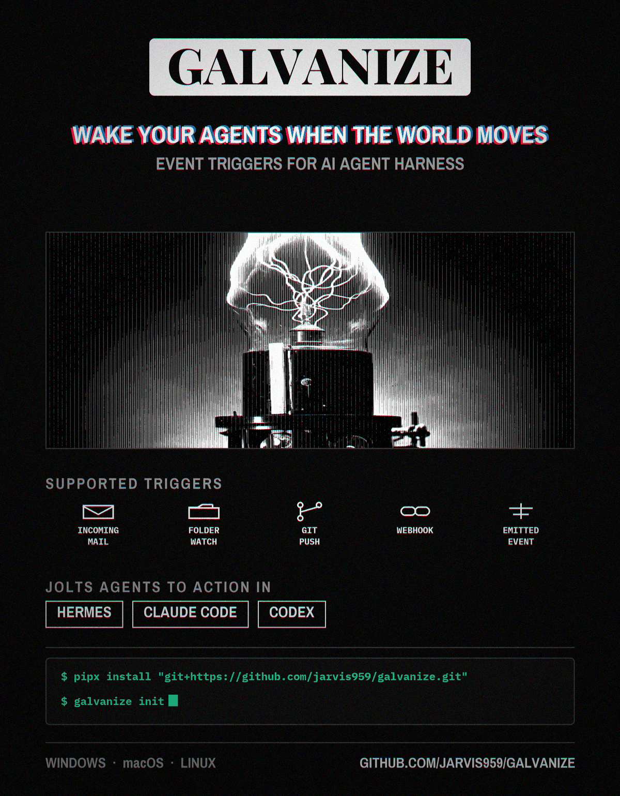

**Wake your AI agent when something happens.**

galvanize watches the real world (new mail, a file landing in a folder, a git commit, a webhook call, an event from a script) and starts a fresh AI agent session with a prompt you wrote the moment one occurs. Event triggers sit directly in the agent's own tool list (native plugin for Hermes, MCP server for Claude Code and Codex), so "wake me when resumes land" wires an actual push trigger. Passwords go to your OS keyring, each trigger starts watching in seconds, and results arrive wherever you asked (Telegram, Discord, or the log).

## Install

Works on Windows, macOS, and Linux (Python 3.10+). One command:

```bash
pipx install galvanize        # or: uv tool install galvanize
                              # or: pip install galvanize
```

(Prefer the bleeding edge straight from GitHub:
`pipx install "git+https://github.com/jarvis959/galvanize.git"`)

Then run setup once:

```bash
galvanize init
```

`init` enables the Hermes webhook platform (backs up your config first), installs the agent plugin, registers the daemon to start at login, and auto-registers the MCP tool surface into Claude Code / Codex if it finds them on this machine. Everything is confirmed on screen and reversible; `--yes` accepts defaults.

After that, the whole surface is five verbs:

```bash
galvanize add folder ~/watch --wake hermes             # + a live test fire
galvanize add imap you@gmail.com --wake hermes         # app-password to keyring
galvanize status           # watching? last fire, errors, health
galvanize doctor           # deep health check
galvanize test cad-drops   # inject a synthetic event through the real path
```

## Why

Cron polling is usually the only event surface an agent can see, so "trigger me when X" becomes an hourly poller. galvanize puts event triggers *in the agent's own tool list*, so the agent wires a real push trigger.

- **Fresh sessions.** Each event spawns a clean one-shot run; results are delivered where you asked.
- **Management everywhere cron is managed.** Dashboard `/triggers` tab, `/triggers` slash command, `hermes triggers` CLI, agent tools, plus `galvanize status` / `doctor` / `daemon`: all surfaces, one ops core.
- **Push email.** IMAP IDLE with 25-min re-arm, UID dedupe, reconnect catch-up, keyring-held credentials, and a `migrate hermes-cron` command that converts your existing email pollers.
- **Zero-inbound-port webhooks.** Optional user-owned Cloudflare Worker relay (`relay/worker.js`): services POST to your URL, your laptop pulls the queue.

## Working with each harness

### Hermes

`galvanize init` does the setup: enables `platforms.webhook` in your `config.yaml` (backup saved first), pip-installs the package into the interpreter Hermes runs in, copies the plugin into `~/.hermes/plugins` and enables it. Restart the Hermes gateway once to load the webhook platform; the `trigger_*` tools appear in new sessions. From then on, "wake me when a file lands in ~/cad-drops" creates a real trigger in conversation.

### Claude Code / Codex

`init` writes the MCP server entry into `~/.claude.json` / `~/.codex/config.toml` automatically when it finds them (Codex gets `default_tools_approval_mode = "approve"` pre-declared, as newer Codex builds otherwise hide the tools). New session: `trigger_add` and friends are in the tool list. Wake presets:

```bash
galvanize add folder ~/inbox --wake claude   # claude -p "{prompt}"
galvanize add folder ~/inbox --wake codex    # codex exec (sandbox pre-declared)
galvanize add git-hook ~/code/myrepo --wake codex   # wake Codex on commits
```

### Any other CLI agent

```bash
galvanize add folder ~/watch --wake shell --command 'myagent run "{prompt}"'
```

## Daily use

The agent's own `trigger_add` tool is the primary creation path; the CLI is the fallback for use without an agent. Both write the same `~/.galvanize/triggers.yaml`, and the dashboard tab manages what either creates.

## Development

```bash
git clone https://github.com/jarvis959/galvanize && cd galvanize
python -m venv .venv && .venv/bin/pip install -e ".[dev]"   # Scripts/ on Windows
.venv/bin/pytest                     # unit suite; live-lane + docker tests skip cleanly
```

The live Hermes-lane test runs inside a Hermes checkout's venv (`pytest tests/test_live_hermes_lane.py`); the IMAP suite drives a GreenMail container and skips when Docker is unavailable.

MIT licensed. Built for the Hermes ecosystem; architecture is harness-neutral.
